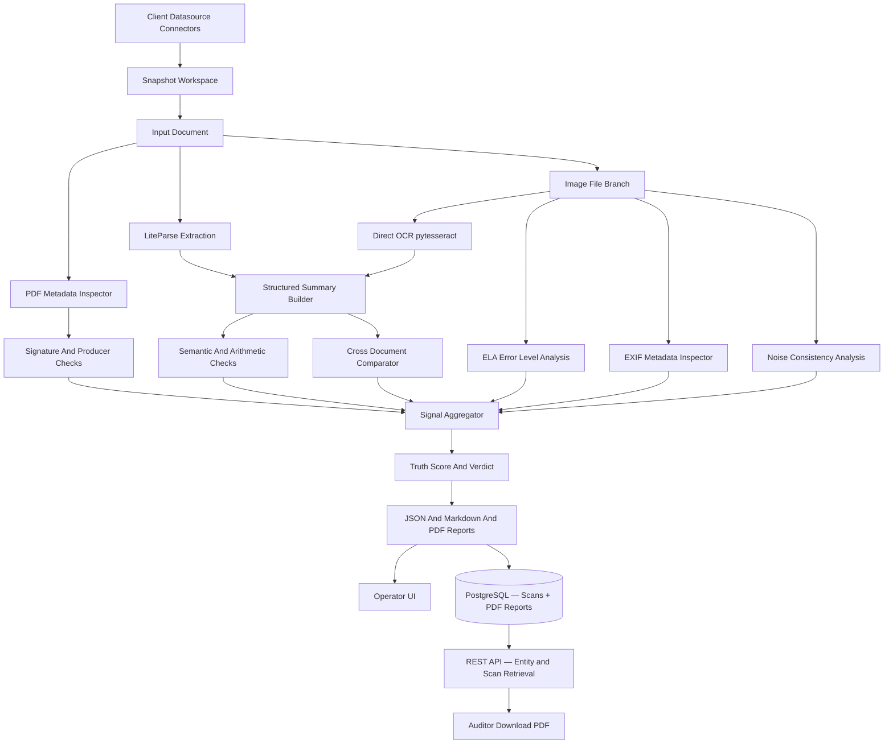

# Architecture

## System Overview

BaseTruth runs a micro-DAG style pipeline where each detector contributes signals to a final truth score.



## Layers

### 1. Ingestion Layer

- accepts PDF files directly
- accepts raw image files (.jpg, .jpeg, .png, .tiff, .bmp, .webp) directly — no PDF wrapper needed
- accepts LiteParse JSON outputs directly
- supports datasource connectors such as folder sync and manifest-driven ingest
- snapshots client documents into a BaseTruth-managed workspace before scanning
- produces deterministic artifact directories for each scan

### 1A. Operator UI Layer

- supports single-file upload and immediate scan
- supports bulk upload and folder-driven scan workflows
- supports datasource registration, sync, and scan operations
- supports report review without requiring analysts to browse the filesystem manually
- supports case-centric review by grouping related verification reports

### 1B. Connector Layer

- supports local folder and manifest-based ingest today
- now supports enterprise pull connectors for S3, Google Drive, and SharePoint
- keeps connectors separate from the forensic engine so ingest can evolve independently
- snapshots remote content into the same BaseTruth evidence workspace as local content

### 2. Parsing Layer

- uses LiteParse when available for structure-preserving extraction
- builds normalized label-value pairs and domain summaries
- for raw image files: uses pytesseract OCR directly (no Poppler required) then feeds the same normalisation pipeline
- is intentionally separate from fraud scoring so parsing can be reused elsewhere

### 3. Metadata Layer

- inspects PDF producer and creator fields
- captures creation and modification timestamps when available
- scans for signature markers such as `/Sig`, `/FT /Sig`, `/ByteRange`, and `/Contents`
- for raw image files: inspects EXIF tags (Make, Model, Software, DateTimeOriginal, etc.) via Pillow and exifread

### 4. Logic Layer (Validation Packs)

The logic layer is organised around industry-specific validation packs housed in
`src/basetruth/analysis/packs/`.  Each pack is a self-contained Python module that
inherits from `BaseValidationPack` and declares its own required fields and
domain rules.  Adding a new industry requires only three steps: create the module,
declare the pack, and register it in `packs/__init__.py` — no changes to any
existing file (Open/Closed Principle).

Registered packs:

| Document Type     | Pack Class                  | Industry                        |
|-------------------|-----------------------------|---------------------------------|
| `payslip`         | `PayrollValidationPack`     | Payroll and HR operations       |
| `bank_statement`  | `BankingValidationPack`     | Banking and lending             |
| `payment_receipt` | `PaymentsValidationPack`    | Payments and fintech            |
| `insurance`       | `InsuranceValidationPack`   | Insurance claims                |
| `healthcare`      | `HealthcareValidationPack`  | Hospitals and healthcare        |
| `invoice`         | `InvoiceValidationPack`     | Commercial and GST invoices     |
| `compliance`      | `ComplianceValidationPack`  | Compliance teams and audit      |
| `mortgage`        | `MortgageValidationPack`    | Home-loan / mortgage bundles    |
| `employment_letter` | `MortgageValidationPack`  | Employment verification letters |
| `form16`          | `MortgageValidationPack`    | TDS certificates (Form 16)      |
| `utility_bill`    | `MortgageValidationPack`    | Utility bills (residency proof) |
| `gift_letter`     | `MortgageValidationPack`    | Gift declaration letters        |
| `property_agreement` | `MortgageValidationPack` | Property sale agreements        |

Each pack:
- validates arithmetic consistency (gross vs net, balance identity, subtotal + tax = total)
- validates required field presence
- validates domain-specific formats (IFSC, UAN, GSTIN, UPI ID, policy numbers)
- validates amount and date plausibility

### 5. Comparison Layer

- compares structured summaries across a document series
- currently optimized for monthly payslip analysis
- designed to expand to invoices, claims, statements, and KYC documents

### 6. Image Forensics Layer (`src/basetruth/analysis/image_forensics.py`)

Activated automatically when the input is a raw image file (.jpg, .png, .tiff, etc.).

| Check | Tool | What it catches |
|---|---|---|
| EXIF suspicious tool detection | Pillow + exifread | Photoshop, GIMP, Canva, AI generators in Software/CreatorTool tags |
| Missing camera EXIF | Pillow | Screenshots and generated images lacking Make/Model metadata |
| Timestamp inconsistency | Pillow EXIF | Backdated capture timestamps |
| Error Level Analysis (ELA) | Pillow + NumPy | Copy-paste, text replacement, region editing |
| Noise consistency CV | OpenCV + NumPy | Local editing leaving mismatched noise patterns |

ELA works by resaving the image at a known JPEG quality (95 %) and measuring per-pixel differences.  Genuine unedited images show uniform error; edited regions re-compress differently and emit abnormally high pixel deltas.

**Risk scoring thresholds:**
- ELA score < 8 → no penalty
- ELA score 8–20 → low penalty (15 pts) — mild artefacts
- ELA score ≥ 20 → high penalty (40 pts) — strong editing signature
- Suspicious tool in EXIF → 45 pts
- Noise CV > 1.5 → 25 pts

### 6.1 Identity Verification Layer (`src/basetruth/vision/face.py`)

A standalone offline deep-learning engine dedicated to verifying the identity of individuals across multiple documents (e.g., Aadhaar card vs. Live Selfie).

| Component | Purpose |
|---|---|
| RetinaFace (ONNX) | Detects facial boundaries and extracts 5-point alignment landmarks securely. |
| ArcFace (ONNX) | Encodes the aligned face into a 512-dimensional vector. |
| OpenCV (`cv2`) | Handles bounding box tracing, BGR/RGB mapping, and image byte decoding prior to analysis. |

*Detailed workflow and thresholds are documented in [Identity Verification](IDENTITY_VERIFICATION.md).*

### 7. Reporting Layer

- emits JSON for machines
- emits Markdown for humans and audit trails
- emits PDF audit reports (FPDF2) for loan officers and non-technical reviewers
- PDF reports are stored as binary blobs in the `scans.pdf_report` PostgreSQL column
- auditors can retrieve any historical PDF via `GET /api/v1/scans/{id}/report.pdf`

### 8. Persistence Layer (PostgreSQL)

| Table | Purpose |
|---|---|
| `entities` | One row per verified person/organisation; searchable by name, PAN, Aadhaar, email, phone |
| `scans` | One row per document scan; stores `report_json` (JSONB) + `pdf_report` (LargeBinary) |
| `cases` | Case-management workflow record linked to an entity |
| `case_notes` | Timestamped analyst notes on a case |

The application degrades gracefully to file-only mode when `DATABASE_URL` is not set.

### 9. REST API Layer (`src/basetruth/api.py`)

Key endpoints for auditor workflows:

| Endpoint | Description |
|---|---|
| `GET /api/v1/entities?q=…` | Search entity registry by name / PAN / Aadhaar |
| `GET /api/v1/entities/{ref}` | Entity detail with all linked scans |
| `GET /api/v1/entities/{ref}/scans` | Full scan history with signals for one entity |
| `GET /api/v1/scans/{id}/report.pdf` | Download the PDF audit report for a specific scan |
| `GET /api/v1/scans/recent` | Most-recent scans across all entities |
| `GET /api/v1/db/stats` | Entity / scan / high-risk counts for dashboards |

## 10. Operator UI — Page Routing

The UI is a **single-entry Streamlit app** at `src/basetruth/ui/app.py`.

Navigation is driven entirely by `st.session_state["page"]` — not by Streamlit's native page routing.  This gives full control over the sidebar and prevents Streamlit from auto-discovering `pages/` files.

```text
app.py  →  main()  →  session_state["page"]
                            │
       ┌────────────────────┼────────────────────────┐
       │                    │                        │
 pages/dashboard.py   pages/identity.py   pages/scan.py  …
```

Streamlit auto-discovers any `.py` file in a `pages/` directory and adds it to the sidebar.  We suppress this two ways:

1. **Config** — `.streamlit/config.toml`: `hideSidebarNav = true` (supported in most Streamlit versions)
2. **CSS fallback** — `_CSS` in `app.py`: `[data-testid="stSidebarNav"] { display: none !important; }`

Both are applied so the nav items are hidden regardless of Streamlit version.

## 11. Identity Verification UI

The Identity Verification page (`pages/identity.py`) accepts documents in two modes, selectable via tabs:

| Tab | How it works |
|---|---|
| **📁 Upload Documents** | Three drag-and-drop uploaders — Aadhaar Card, PAN Card, Selfie. Aadhaar QR is decoded and PAN OCR runs immediately on upload, results shown inline in the same column. |
| **📷 Capture with Camera** | Per-document "Open Camera" buttons. Camera only opens on click. The native shutter button takes the photo. Photos are stored in session state and persist across rerenders. A tips banner guides the user to get a sharp, well-lit capture. |

Camera captures are wrapped in a `_DocumentCapture` class that matches the `UploadedFile` API (`.size`, `.name`, `.getvalue()`) so all downstream processing is source-agnostic.

### Image Quality Pipeline for Camera Captures

Camera images often suffer from glare, shadows, or lower resolution. Both the QR decoder and PAN OCR apply a multi-strategy preprocessing cascade before analysis:

**Aadhaar QR (`_parse_aadhaar_qr`)**

The function tries the following in order, stopping as soon as the QR code decodes successfully:

1. Original colour image
2. Grayscale
3. Denoised grayscale (`fastNlMeansDenoising` — removes camera sensor noise)
4. CLAHE contrast-enhanced
5. Adaptive Gaussian threshold (handles uneven lighting)
6. Adaptive mean threshold
7. Otsu global threshold
8. Sharpened
9. Each of the above at **2×, 3×, 4× upscale** (for low-resolution captures)

**PAN Card OCR (`_extract_pan_info`)**

- Image is resized to a maximum of **2 400 px wide** (raised from 1 200) and upscaled up to **2.5×** (raised from 1.5×) for small camera captures
- Preprocessing variants: plain gray → denoised → Otsu → CLAHE → sharpened → adaptive Gaussian threshold
- Multiple Tesseract PSM modes are tried; the one that returns a valid PAN format wins

**PDF report** — `render_identity_check_pdf()` embeds the ID document image and selfie as a Photo Evidence section alongside the match verdict and similarity scores.

## Why This Shape

This architecture lets BaseTruth scale from a local analyst tool into an enterprise service without replacing the core reasoning model.

The key product decision is to keep client data sources read-only and pull from them into BaseTruth snapshots. That is safer than treating a single mutable shared folder as the system of record.

PDF reports are stored in PostgreSQL alongside the JSON so auditors can retrieve the full explanation for any historical flag without needing filesystem access.  This is the foundation for the chain-of-custody export planned in Phase 4.
