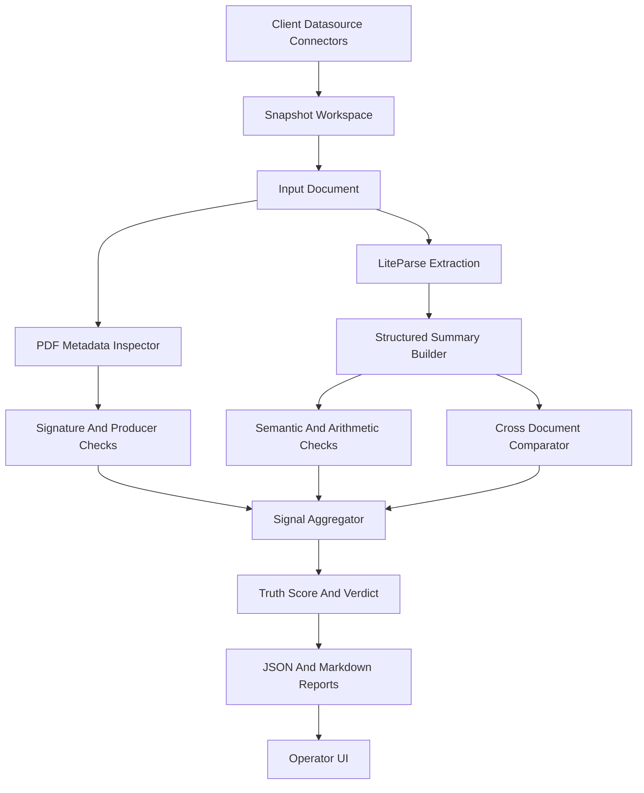

# Architecture

## System Overview

BaseTruth runs a micro-DAG style pipeline where each detector contributes signals to a final truth score.

## Layers

### 1. Ingestion Layer

- accepts PDF files directly
- accepts LiteParse JSON outputs directly
- supports datasource connectors such as folder sync and manifest-driven ingest
- snapshots client documents into a BaseTruth-managed workspace before scanning
- produces deterministic artifact directories for each scan

### 1A. Operator UI Layer

- supports single-file upload and immediate scan
- supports bulk upload and folder-driven scan workflows
- supports datasource registration, sync, and scan operations
- supports report review without requiring analysts to browse the filesystem manually
- supports case-centric review by grouping related verification reports

### 1B. Connector Layer

- supports local folder and manifest-based ingest today
- now supports enterprise pull connectors for S3, Google Drive, and SharePoint
- keeps connectors separate from the forensic engine so ingest can evolve independently
- snapshots remote content into the same BaseTruth evidence workspace as local content

### 2. Parsing Layer

- uses LiteParse when available for structure-preserving extraction
- builds normalized label-value pairs and domain summaries
- is intentionally separate from fraud scoring so parsing can be reused elsewhere

### 3. Metadata Layer

- inspects PDF producer and creator fields
- captures creation and modification timestamps when available
- scans for signature markers such as `/Sig`, `/FT /Sig`, `/ByteRange`, and `/Contents`

### 4. Logic Layer (Validation Packs)

The logic layer is organised around industry-specific validation packs housed in
`src/basetruth/analysis/packs/`.  Each pack is a self-contained Python module that
inherits from `BaseValidationPack` and declares its own required fields and
domain rules.  Adding a new industry requires only three steps: create the module,
declare the pack, and register it in `packs/__init__.py` — no changes to any
existing file (Open/Closed Principle).

Registered packs:

| Document Type     | Pack Class                  | Industry                        |
|-------------------|-----------------------------|---------------------------------|
| `payslip`         | `PayrollValidationPack`     | Payroll and HR operations       |
| `bank_statement`  | `BankingValidationPack`     | Banking and lending             |
| `payment_receipt` | `PaymentsValidationPack`    | Payments and fintech            |
| `insurance`       | `InsuranceValidationPack`   | Insurance claims                |
| `healthcare`      | `HealthcareValidationPack`  | Hospitals and healthcare        |
| `invoice`         | `InvoiceValidationPack`     | Commercial and GST invoices     |
| `compliance`      | `ComplianceValidationPack`  | Compliance teams and audit      |

Each pack:
- validates arithmetic consistency (gross vs net, balance identity, subtotal + tax = total)
- validates required field presence
- validates domain-specific formats (IFSC, UAN, GSTIN, UPI ID, policy numbers)
- validates amount and date plausibility

### 5. Comparison Layer

- compares structured summaries across a document series
- currently optimized for monthly payslip analysis
- designed to expand to invoices, claims, statements, and KYC documents

### 6. Reporting Layer

- emits JSON for machines
- emits Markdown for humans and audit trails

## Why This Shape

This architecture lets BaseTruth scale from a local analyst tool into an enterprise service without replacing the core reasoning model.

The key product decision is to keep client data sources read-only and pull from them into BaseTruth snapshots. That is safer than treating a single mutable shared folder as the system of record.
