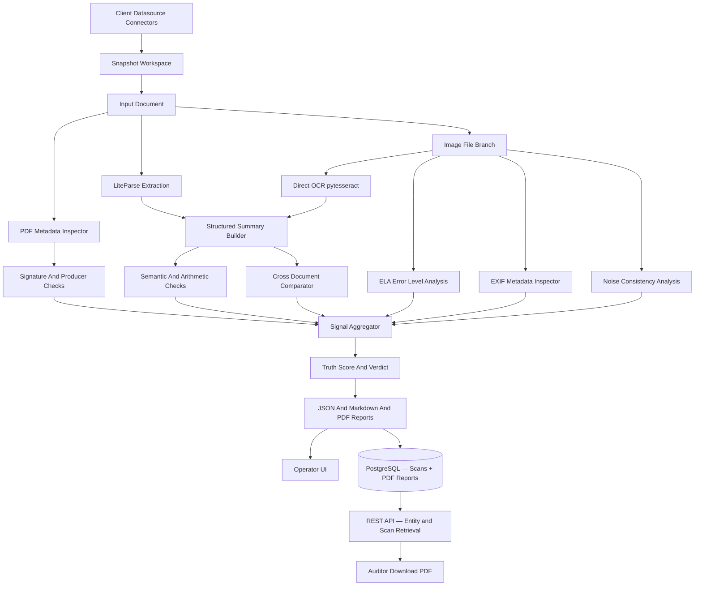

# Architecture

## System Overview

BaseTruth runs a micro-DAG style pipeline where each detector contributes signals to a final truth score.



## Layers

### 1. Ingestion Layer

- accepts PDF files directly
- accepts raw image files (.jpg, .jpeg, .png, .tiff, .bmp, .webp) directly — no PDF wrapper needed
- accepts LiteParse JSON outputs directly
- supports datasource connectors such as folder sync and manifest-driven ingest
- snapshots client documents into a BaseTruth-managed workspace before scanning
- produces deterministic artifact directories for each scan

### 1A. Operator UI Layer

- supports single-file upload and immediate scan
- supports bulk upload and folder-driven scan workflows
- supports datasource registration, sync, and scan operations
- supports report review without requiring analysts to browse the filesystem manually
- supports case-centric review by grouping related verification reports

### 1B. Connector Layer

- supports local folder and manifest-based ingest today
- now supports enterprise pull connectors for S3, Google Drive, and SharePoint
- keeps connectors separate from the forensic engine so ingest can evolve independently
- snapshots remote content into the same BaseTruth evidence workspace as local content

### 2. Parsing Layer

- uses LiteParse when available for structure-preserving extraction
- builds normalized label-value pairs and domain summaries
- for raw image files: uses pytesseract OCR directly (no Poppler required) then feeds the same normalisation pipeline
- is intentionally separate from fraud scoring so parsing can be reused elsewhere

### 3. Metadata Layer

- inspects PDF producer and creator fields
- captures creation and modification timestamps when available
- scans for signature markers such as `/Sig`, `/FT /Sig`, `/ByteRange`, and `/Contents`
- for raw image files: inspects EXIF tags (Make, Model, Software, DateTimeOriginal, etc.) via Pillow and exifread

### 4. Logic Layer (Validation Packs)

The logic layer is organised around industry-specific validation packs housed in
`src/basetruth/analysis/packs/`.  Each pack is a self-contained Python module that
inherits from `BaseValidationPack` and declares its own required fields and
domain rules.  Adding a new industry requires only three steps: create the module,
declare the pack, and register it in `packs/__init__.py` — no changes to any
existing file (Open/Closed Principle).

Registered packs:

| Document Type     | Pack Class                  | Industry                        |
|-------------------|-----------------------------|---------------------------------|
| `payslip`         | `PayrollValidationPack`     | Payroll and HR operations       |
| `bank_statement`  | `BankingValidationPack`     | Banking and lending             |
| `payment_receipt` | `PaymentsValidationPack`    | Payments and fintech            |
| `insurance`       | `InsuranceValidationPack`   | Insurance claims                |
| `healthcare`      | `HealthcareValidationPack`  | Hospitals and healthcare        |
| `invoice`         | `InvoiceValidationPack`     | Commercial and GST invoices     |
| `compliance`      | `ComplianceValidationPack`  | Compliance teams and audit      |
| `mortgage`        | `MortgageValidationPack`    | Home-loan / mortgage bundles    |
| `employment_letter` | `MortgageValidationPack`  | Employment verification letters |
| `form16`          | `MortgageValidationPack`    | TDS certificates (Form 16)      |
| `utility_bill`    | `MortgageValidationPack`    | Utility bills (residency proof) |
| `gift_letter`     | `MortgageValidationPack`    | Gift declaration letters        |
| `property_agreement` | `MortgageValidationPack` | Property sale agreements        |

Each pack:
- validates arithmetic consistency (gross vs net, balance identity, subtotal + tax = total)
- validates required field presence
- validates domain-specific formats (IFSC, UAN, GSTIN, UPI ID, policy numbers)
- validates amount and date plausibility

### 5. Comparison Layer

- compares structured summaries across a document series
- currently optimized for monthly payslip analysis
- designed to expand to invoices, claims, statements, and KYC documents

### 6. Image Forensics Layer (`src/basetruth/analysis/image_forensics.py`)

Activated automatically when the input is a raw image file (.jpg, .png, .tiff, etc.).

| Check | Tool | What it catches |
|---|---|---|
| EXIF suspicious tool detection | Pillow + exifread | Photoshop, GIMP, Canva, AI generators in Software/CreatorTool tags |
| Missing camera EXIF | Pillow | Screenshots and generated images lacking Make/Model metadata |
| Timestamp inconsistency | Pillow EXIF | Backdated capture timestamps |
| Error Level Analysis (ELA) | Pillow + NumPy | Copy-paste, text replacement, region editing |
| Noise consistency CV | OpenCV + NumPy | Local editing leaving mismatched noise patterns |

ELA works by resaving the image at a known JPEG quality (95 %) and measuring per-pixel differences.  Genuine unedited images show uniform error; edited regions re-compress differently and emit abnormally high pixel deltas.

**Risk scoring thresholds:**
- ELA score < 8 → no penalty
- ELA score 8–20 → low penalty (15 pts) — mild artefacts
- ELA score ≥ 20 → high penalty (40 pts) — strong editing signature
- Suspicious tool in EXIF → 45 pts
- Noise CV > 1.5 → 25 pts

### 6.1 Identity Verification Layer (`src/basetruth/vision/face.py`)

A standalone offline deep-learning engine dedicated to verifying the identity of individuals across multiple documents (e.g., Aadhaar card vs. Live Selfie) and running real-time liveness challenges over WebSocket.

**Face detector selection (automatic):**

| Environment | Detector | Notes |
|---|---|---|
| Docker / Python ≤ 3.12 | InsightFace (RetinaFace + ArcFace, ONNX) | Full identity embedding + face match |
| Python 3.13+ (local dev) | **MediaPipe FaceLandmarker** | Liveness-only; face match skipped |

| Component | Purpose |
|---|---|
| MediaPipe FaceLandmarker | Detects 468 facial landmarks and outputs blendshape scores (e.g. `eyeBlinkLeft`). Used as default on Python 3.13+. Model: `your_data/models/face_landmarker.task`. |
| InsightFace RetinaFace (ONNX) | Detects facial boundaries and extracts 5-point alignment landmarks. Available on Linux/Python ≤ 3.12. |
| InsightFace ArcFace (ONNX) | Encodes the aligned face into a 512-dimensional identity vector. Required for face-match scoring. |
| OpenCV (`cv2`) | Handles bounding box tracing, BGR/RGB mapping, and image byte decoding prior to analysis. |

*Detailed workflow, challenge thresholds, and face-match scoring are documented in [Identity Verification](IDENTITY_VERIFICATION.md).*

### 7. Reporting Layer

- emits JSON for machines
- emits Markdown for humans and audit trails
- emits PDF audit reports (FPDF2) for loan officers and non-technical reviewers
- PDF reports are stored as binary blobs in the `scans.pdf_report` PostgreSQL column
- auditors can retrieve any historical PDF via `GET /api/v1/scans/{id}/report.pdf`

### 8. Persistence Layer (PostgreSQL)

| Table | Purpose |
|---|---|
| `entities` | One row per verified person/organisation; searchable by name, PAN, Aadhaar, email, phone |
| `scans` | One row per document scan; stores `report_json` (JSONB) + `pdf_report` (LargeBinary) |
| `cases` | Case-management workflow record linked to an entity |
| `case_notes` | Timestamped analyst notes on a case |

The application degrades gracefully to file-only mode when `DATABASE_URL` is not set.

### 9. REST API Layer (`src/basetruth/api.py`)

Key endpoints for auditor workflows:

| Endpoint | Description |
|---|---|
| `GET /api/v1/entities?q=…` | Search entity registry by name / PAN / Aadhaar |
| `GET /api/v1/entities/{ref}` | Entity detail with all linked scans |
| `GET /api/v1/entities/{ref}/scans` | Full scan history with signals for one entity |
| `GET /api/v1/scans/{id}/report.pdf` | Download the PDF audit report for a specific scan |
| `GET /api/v1/scans/recent` | Most-recent scans across all entities |
| `GET /api/v1/db/stats` | Entity / scan / high-risk counts for dashboards |
| `POST /kyc/sessions` | Create a Video KYC session (returns a shareable URL) |
| `GET /kyc/{session_id}` | Customer-facing Video KYC page (served in browser) |
| `GET /kyc/sessions/{session_id}` | Poll session status from the operator dashboard |
| `WS /kyc/ws/{session_id}` | WebSocket: browser streams frames; server sends liveness results |

## 10. Operator UI — Page Routing

The UI is a **single-entry Streamlit app** at `src/basetruth/ui/app.py`.

Navigation is driven entirely by `st.session_state["page"]` — not by Streamlit's native page routing.  This gives full control over the sidebar and prevents Streamlit from auto-discovering `pages/` files.

```text
app.py  →  main()  →  session_state["page"]
                            │
       ┌────────────────────┼────────────────────────┐
       │                    │                        │
 pages/dashboard.py   pages/identity.py   pages/scan.py  …
```

Streamlit auto-discovers any `.py` file in a `pages/` directory and adds it to the sidebar.  We suppress this two ways:

1. **Config** — `.streamlit/config.toml`: `hideSidebarNav = true` (supported in most Streamlit versions)
2. **CSS fallback** — `_CSS` in `app.py`: `[data-testid="stSidebarNav"] { display: none !important; }`

Both are applied so the nav items are hidden regardless of Streamlit version.

### Sidebar navigation labels

Each sidebar entry maps a display label → session-state page key.  The label emoji and title text must always match the corresponding `_page_title(emoji, "Title Text")` call in the page file.  See [FUNCTIONALITY.md](FUNCTIONALITY.md) for the full mapping and rules.

### Performance: cached availability checks

`db_available()` runs a live `SELECT 1` and `minio_available()` calls `list_buckets()`.  Calling either in the Streamlit render path freezes the UI for up to 5 seconds per click when the services are offline.

**Rule:** always use `_db_available_cached()` and `_minio_available_cached()` from `components.py` (30-second TTL) in any render path.  Raw `db_available()` / `minio_available()` calls are only allowed in non-render code (background jobs, CLI tools).

## 11. Identity Verification UI

The Identity Verification page (`pages/identity.py`) accepts documents in two modes, selectable via tabs:

| Tab | How it works |
|---|---|
| **📁 Upload Documents** | Three drag-and-drop uploaders — Aadhaar Card, PAN Card, Selfie. Aadhaar QR is decoded and PAN OCR runs immediately on upload, results shown inline in the same column. |
| **📷 Capture with Camera** | Per-document "Open Camera" buttons. Camera only opens on click. The native shutter button takes the photo. Photos are stored in session state and persist across re-renders. A tips banner guides the user to get a sharp, well-lit capture. |

Camera captures are wrapped in a `_DocumentCapture` class that matches the `UploadedFile` API (`.size`, `.name`, `.getvalue()`) so all downstream processing is source-agnostic.

### Image Quality Pipeline for Camera Captures

Camera images often suffer from glare, shadows, or lower resolution. Both the QR decoder and PAN OCR apply a multi-strategy preprocessing cascade before analysis:

**Aadhaar QR (`_parse_aadhaar_qr`)**

The function tries the following in order, stopping as soon as the QR code decodes:

1. **WeChatQRCode** (OpenCV contrib, deep-learning based) — best for blurry, perspective-distorted, or low-resolution camera captures
2. Classic `QRCodeDetector` with a preprocessing cascade:
   - Original colour → grayscale → denoised → CLAHE → adaptive Gaussian threshold → adaptive mean threshold → Otsu → sharpened
3. WeChatQRCode again on each **2×, 3×, 4× upscale** of the image
4. Classic detector on each upscaled variant

`opencv-contrib-python` (replaces `opencv-python` in `requirements.txt`) provides the WeChatQRCode model.

**PAN Card OCR (`_extract_pan_info`)**

- Image resized to max **2 400 px wide** (raised from 1 200) and upscaled up to **2.5×** (raised from 1.5×) for small camera captures
- Preprocessing variants: plain gray → denoised (`fastNlMeansDenoising`) → Otsu → CLAHE → sharpened → adaptive Gaussian threshold
- Multiple Tesseract PSM modes tried; first one to return a valid PAN format wins

**PDF report** — `render_identity_check_pdf()` embeds the ID document image and selfie as a Photo Evidence section alongside the match verdict and similarity scores.

## 12. Video KYC Workflow

The Video KYC page (`pages/video_kyc.py`) has three tabs: **Start Session**, **Schedule**, and **In-Person Verify**.

### Why Build Our Own Video Layer?

Zoom and Teams do not let the server touch raw video frames — so AI face-match and liveness checks are impossible on those platforms. BaseTruth solves this by running its own lightweight WebSocket video layer:

- The customer opens a URL in their browser. No app, no plugin, no account needed.
- Their camera streams JPEG frames to the server every ~300 ms.
- The server runs RetinaFace (face detection) and ArcFace (face match) on every frame.
- Results flow back as JSON in real time.

### How It Works — Architecture Diagram

```mermaid
flowchart TD
    A([Agent Dashboard\nStreamlit :8501]) -->|POST /kyc/sessions\nreference embedding + challenges| B[FastAPI :8000]
    B -->|session_id + URL| A
    A -->|shares URL| C([Customer Browser])

    C -->|opens /kyc/{session_id}| B
    B -->|serves KYC HTML page| C

    C -->|getUserMedia → canvas → JPEG| D{WebSocket\n/kyc/ws/{id}}
    D -->|base64 frame| E[_process_kyc_frame]
    E --> F[RetinaFace\nface detect]
    F -->|no face| G[status: no face]
    F -->|face found| H[extract_features\n5-pt landmarks]
    H --> I[analyze_challenge\nturn / nod / blink]
    I -->|not passed yet| J[status: feedback hint]
    I -->|challenge passed| K{All challenges\ndone?}
    K -->|no| L[advance to next\nchallenge]
    K -->|yes| M[run_face_match\nArcFace cosine sim]
    M -->|sim ≥ 0.40| N([result: PASS ✅])
    M -->|sim < 0.40| O([result: FAIL ❌])

    G & J & L --> D
    N & O --> A
```

### Session Lifecycle

```
waiting  →  active  →  completed
                    ↘  failed
                    ↘  expired (after 30 min)
```

### Challenge Detection (5-point RetinaFace landmarks)

All positions are normalised by face bounding-box width so they work at any camera distance.

| Challenge      | How it is detected                                                | Pass condition                              |
|----------------|-------------------------------------------------------------------|---------------------------------------------|
| `turn_left`    | Nose moves right in image → `nose_rel_x` rises                   | `nose_rel_x > 0.62` in any recent frame     |
| `turn_right`   | Nose moves left in image → `nose_rel_x` falls                    | `nose_rel_x < 0.38` in any recent frame     |
| `nod`          | Nose moves below eye midpoint → `pitch` range widens             | pitch range `> 0.28` over ≥6 frames         |
| `blink`        | Eyes close → Eye Aspect Ratio (EAR) drops then recovers          | EAR drops below 0.15 then recovers above 0.18 |

> **EAR source:** MediaPipe FaceLandmarker blendshape scores are always used for blink detection, regardless of whether InsightFace or MediaPipe handles face detection. When InsightFace is active (Docker / Python ≤ 3.12), both models run per frame: InsightFace for face-match embedding and MediaPipe for EAR. This ensures reliable blink detection at any camera distance.

By default, 2 challenges are chosen at random per session. The agent can override this in the dashboard.

### Key Files

| File | Purpose |
|------|---------|
| `src/basetruth/kyc/session.py` | `KYCSession` dataclass + thread-safe `SessionStore` |
| `src/basetruth/kyc/liveness.py` | `extract_features()`, `analyze_challenge()`, `run_face_match()` |
| `src/basetruth/api.py` | FastAPI routes + WebSocket handler |
| `src/basetruth/ui/pages/video_kyc.py` | Agent dashboard (3 tabs) |
| `src/basetruth/vision/face.py` | InsightFace + MediaPipe initialisation |

### API Endpoints

| Method      | Path                         | Description                               |
|-------------|------------------------------|-------------------------------------------|
| `POST`      | `/kyc/sessions`              | Create session; returns session URL       |
| `GET`       | `/kyc/{session_id}`          | Serve customer HTML page                  |
| `WebSocket` | `/kyc/ws/{session_id}`       | Frame stream in → status/result JSON out  |
| `GET`       | `/kyc/sessions/{session_id}` | Agent polls for live status + result      |

### Agent Workflow (Tab 1 — Start KYC Session)

1. Upload the customer's reference ID → BaseTruth extracts the face embedding.
2. Enter customer name and entity ref; optionally pick which challenges to run.
3. Click **Create Secure KYC Session** → the API returns a shareable URL.
4. Send the URL to the customer (message, email, QR code on screen).
5. The dashboard auto-refreshes every 2 s and shows challenge progress as the customer completes them.
6. When done, the verdict (pass/fail + match score) is saved to the database and a PDF report is generated.

### Tab 2 — Schedule Appointment

Generates a `.ics` calendar invite. The **Meeting Link** field auto-fills with the BaseTruth KYC URL from Tab 1, so the customer clicks the calendar event and lands directly on the verification page. No Zoom or Teams account needed.

### Tab 3 — In-Person Verify

For face-to-face KYC at a physical location. Uses `st.camera_input` to capture a single frame — no WebSocket needed. Same RetinaFace + ArcFace logic, saves to the same DB and PDF path.


## Why This Shape

This architecture lets BaseTruth scale from a local analyst tool into an enterprise service without replacing the core reasoning model.

The key product decision is to keep client data sources read-only and pull from them into BaseTruth snapshots. That is safer than treating a single mutable shared folder as the system of record.

PDF reports are stored in PostgreSQL alongside the JSON so auditors can retrieve the full explanation for any historical flag without needing filesystem access. This is the foundation for the chain-of-custody export planned in Phase 4.
