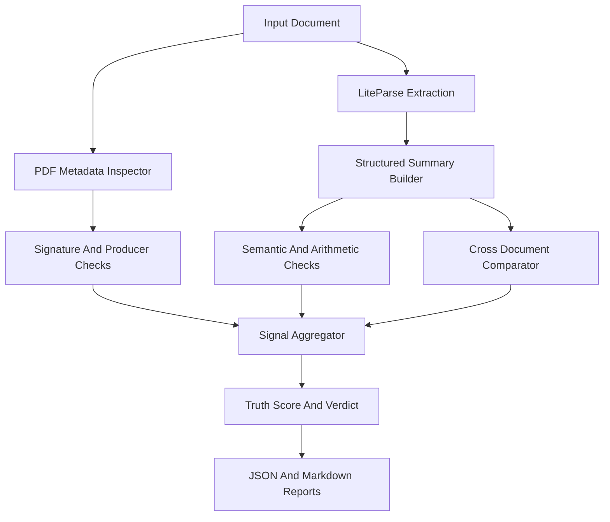

# Architecture

## System Overview

BaseTruth runs a micro-DAG style pipeline where each detector contributes signals to a final truth score.

## Layers

### 1. Ingestion Layer

- accepts PDF files directly
- accepts LiteParse JSON outputs directly
- produces deterministic artifact directories for each scan

### 2. Parsing Layer

- uses LiteParse when available for structure-preserving extraction
- builds normalized label-value pairs and domain summaries
- is intentionally separate from fraud scoring so parsing can be reused elsewhere

### 3. Metadata Layer

- inspects PDF producer and creator fields
- captures creation and modification timestamps when available
- scans for signature markers such as `/Sig`, `/FT /Sig`, `/ByteRange`, and `/Contents`

### 4. Logic Layer

- validates arithmetic consistency
- validates amount-in-words consistency when present
- validates required field presence
- supports future issuer and checksum validation

### 5. Comparison Layer

- compares structured summaries across a document series
- currently optimized for monthly payslip analysis
- designed to expand to invoices, claims, statements, and KYC documents

### 6. Reporting Layer

- emits JSON for machines
- emits Markdown for humans and audit trails

## Why This Shape

This architecture lets BaseTruth scale from a local analyst tool into an enterprise service without replacing the core reasoning model.
