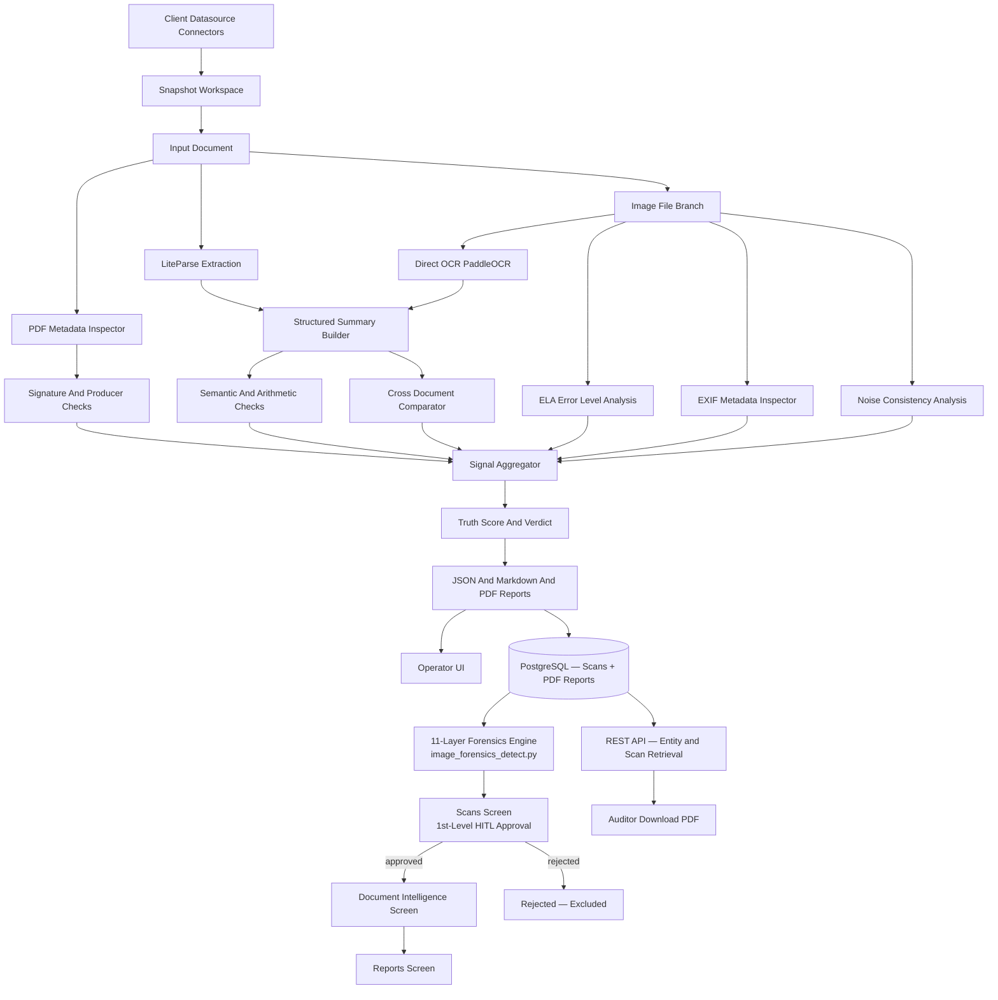

# Architecture

## System Overview

BaseTruth runs a micro-DAG style pipeline where each detector contributes signals to a final truth score.


```mermaid
flowchart TD
  A[Input Document] --> B[PDF Metadata Inspector]
  A --> C[LiteParse Extraction]
  A --> IMG[Image File Branch]
  IMG --> IMGOCR[Direct OCR PaddleOCR]
  IMG --> ELA[ELA Error Level Analysis]
  IMG --> EXIF[EXIF Metadata Inspector]
  IMG --> NOISE[Noise Consistency Analysis]
  X[Client Datasource Connectors] --> Y[Snapshot Workspace]
  Y --> A
  C --> D[Structured Summary Builder]
  D --> E[Semantic And Arithmetic Checks]
  B --> F[Signature And Producer Checks]
  D --> G[Cross Document Comparator]
  IMGOCR --> D
  ELA --> H[Signal Aggregator]
  EXIF --> H
  NOISE --> H
  E --> H
  F --> H
  G --> H
  H --> I[Truth Score And Verdict]
  I --> J[JSON And Markdown And PDF Reports]
  J --> K[Operator UI]
  J --> DB[(PostgreSQL — Scans + PDF Reports)]
  DB --> FORENSICS[11-Layer Forensics Engine\nimage_forensics_detect.py]
  FORENSICS --> SCANS_REVIEW[Scans Screen\n1st-Level HITL Approval]
  SCANS_REVIEW -->|approved| DI[Document Intelligence Screen]
  SCANS_REVIEW -->|rejected| REJECTED[Rejected — Excluded]
  DI --> REPORTS[Reports Screen]
  DB --> API[REST API — Entity and Scan Retrieval]
  API --> AUD[Auditor Download PDF]
```

## Layers

### 1. Ingestion Layer

- accepts PDF files directly
- accepts raw image files (.jpg, .jpeg, .png, .tiff, .bmp, .webp) directly — no PDF wrapper needed
- accepts LiteParse JSON outputs directly
- supports datasource connectors such as folder sync and manifest-driven ingest
- snapshots client documents into a BaseTruth-managed workspace before scanning
- produces deterministic artifact directories for each scan

### 1A. Operator UI Layer

- supports single-file upload and immediate scan
- supports a dedicated single-file Forensic Scan page for instant tamper verdicts without persistence
- supports a dedicated Swagger page that links operators to live OpenAPI docs (`/docs`, `/openapi.json`, `/redoc`)
- supports bulk upload and folder-driven scan workflows
- keeps scan and bulk-scan persistence explicit: operators review results first, then click Save to Database to persist them
- supports datasource registration, sync, and scan operations
- supports report review without requiring analysts to browse the filesystem manually
- supports case-centric review by grouping related verification reports
- separates clean operator workflows from auditor-facing explainability by using a dedicated Layered Analysis screen
- Identity Verification screen runs Aadhaar QR decode, PAN OCR/Gemma4 extraction, and selfie document-type check concurrently via `concurrent.futures.ThreadPoolExecutor` — all three pipelines fire in parallel when multiple documents are uploaded at the same time; total wait equals the slowest pipeline, not the sequential sum
- Bulk Scan runs one Gemma4 batch-classification call first, then dispatches each document's forensic scan plus field extraction to a separate worker process via `concurrent.futures.ProcessPoolExecutor`; total runtime is bounded by the slowest few documents instead of the full sequential batch
- pre-flight document-type validation uses a lightweight Gemma4 classifier call (120 s timeout) before the expensive extraction pipelines; mismatched documents (e.g. Aadhaar card uploaded to PAN slot) are blocked with a red error banner when classifier confidence ≥ 0.65; Ollama unavailability or low confidence always allows the upload through to avoid blocking legitimate documents

### 1B. Connector Layer

- supports local folder and manifest-based ingest today
- now supports enterprise pull connectors for S3, Google Drive, and SharePoint
- keeps connectors separate from the forensic engine so ingest can evolve independently
- snapshots remote content into the same BaseTruth evidence workspace as local content

### 2. Parsing Layer

- uses LiteParse when available for structure-preserving extraction
- builds normalized label-value pairs and domain summaries
- for raw image files: uses PaddleOCR directly (no Poppler or Tesseract dependency) then feeds the same normalisation pipeline
- for marksheets: always runs PaddleOCR for the OCR pass, writes a raw markdown artifact that preserves top-to-bottom row order plus approximate horizontal spacing, and validates printed totals generically against the visible subject rows without relying on SSC/HSC-specific prompt branches
- Gemma4 document-extraction prompts and rule text are stored in `src/basetruth/integrations/document_extract_prompts.md` and loaded on demand by `document_extract.py` so prompt tuning stays separate from parser logic
- BaseTruth Q&A chatbot prompts and DB query rules are stored in `src/basetruth/integrations/qna_prompts.md` and loaded on demand by `db_query.py`; sections: `system_prompt`, `db_query_rules`, `minio_instructions`
- is intentionally separate from fraud scoring so parsing can be reused elsewhere

### 2A. Document Field Extraction Pipeline (`document_extract.py`)

`extract_document_fields()` is the single entry point for field extraction in both the Bulk Scan and single Scan pipelines. It follows a strict step-by-step pipeline that varies based on whether the input is a scanned image or a structured (software-generated) PDF.

#### Step 1 — Convert to JPEG image

Every input is first converted to a JPEG page image using PyMuPDF (for PDFs) or Pillow (for images). This image is always sent to the LLM later so it can see the visual layout of the document.

#### Step 2A — Detect document type: Structured PDF or Scanned Image?

PyMuPDF tries to read the embedded text from the PDF:
- If **more than 200 characters** of clean text are found → the document is a **structured PDF** (generated by payroll software, a bank system, etc.).
- If **fewer than 200 characters** are found → the document is a **scanned image** or a scanned-to-PDF (no real text layer).

#### Step 2B — Two paths based on document type

**Path A: Structured PDF (e.g. payslip, bank statement, offer letter)**

| Step | What happens | Tool used |
|------|-------------|-----------|
| 1 | Read the embedded text directly from the PDF | PyMuPDF (`fitz`) |
| 2 | PaddleOCR is **skipped** — the embedded text is already perfect | — |
| 3 | Send **embedded text + page image** to the LLM | Gemma4 via Ollama (or cloud provider) |
| 4 | The embedded text gives exact numbers and characters; the image gives visual layout context (column alignment, table borders, fonts) | — |

> **Why always send the image even for structured PDFs?** The embedded text tells us *what* is on the page (accurate characters and values). The image tells us *how* it looks (table structure, column groupings, formatting). Sending both together gives the LLM the best chance of correctly pairing labels with values — especially on dense payslip tables where column alignment matters.

**Path B: Scanned Image / Scanned PDF (e.g. marksheet, degree certificate, hospital bill)**

| Step | What happens | Tool used |
|------|-------------|-----------|
| 1 | Render the PDF page to a 3× zoom PNG (or use the raw image) | PyMuPDF (`fitz`) / Pillow |
| 2 | Run PaddleOCR (PP-OCRv4) to extract text and pixel-level bounding box coordinates | PaddleOCR |
| 3 | Reformat extracted rows as `[y=NNNpx x=NNNpx] text text text` so the LLM knows where each word sits | Python |
| 4 | Send **OCR text + bounding box coordinates + page image** to the LLM | Gemma4 via Ollama (or cloud provider) |
| 5 | The coordinates let the LLM pair label columns with value columns (e.g. "Basic Salary" at x=10 → "25,000" at x=220, same y=120 row) | — |

> **Why send all three inputs?** OCR text gives accurate characters; bounding box coordinates show the table structure; the image resolves any OCR ambiguities and shows handwritten or stamped content that OCR may have missed.

**Marksheet special case:** Marksheets always follow Path B (PaddleOCR), even if embedded PDF text is present, because their complex subject-marks table layouts require spatial coordinate data. BaseTruth may also build a deterministic row-by-row marks table from the OCR output, but that result is now used as a **strong hint for the LLM**, not as a replacement for the LLM call. The final extraction still goes through Gemma4 so the model can verify names, totals, and header fields against the original image.

#### Step 3 — Send to LLM and validate

1. A document-type-specific prompt is chosen from `document_extract_prompts.md`.
2. The extracted text, bounding box coordinates (scanned path), and page image are bundled into a single Gemma4 request.
3. The LLM returns a JSON object with all extracted fields.
4. The response is validated against the document's rule pack (field types, required fields, arithmetic consistency).
5. If validation fails **or** the model reports `LOW` extraction confidence, the LLM is called again with a correction prompt (max 1 retry).

#### Extraction pipeline summary (visual)

```
Input document
     │
     ├─ Step 1 ──────────────────────────────────────────────────────────────────
     │   Convert to JPEG page image (PyMuPDF / Pillow)
     │
     ├─ Step 2A ─────────────────────────────────────────────────────────────────
     │   Try to extract embedded PDF text (PyMuPDF)
     │
     ├─ Branch ───────────────────────────────────────────────────────────────────
     │
     │   STRUCTURED PDF (>200 chars embedded text found)     SCANNED IMAGE / SCANNED PDF
     │   ─────────────────────────────────────────────       ──────────────────────────────
     │   • PaddleOCR SKIPPED                                 • PaddleOCR runs on 3× PNG
     │   • Embedded text used directly                       • Text + bounding boxes extracted
     │   • Inputs to LLM: embedded text + image              • Inputs to LLM: OCR text
     │     (image ALWAYS sent — gives layout context)          + bounding box coords + image
     │
     └─ Step 3 ──────────────────────────────────────────────────────────────────
         LLM (Gemma4 / cloud) extracts fields → validate → retry if LOW confidence
         → return structured JSON
```

#### Extracted field schemas (per document category)

All schemas live in `src/basetruth/integrations/document_extract_prompts.md`. Key fields per type:

**Payslip** — `financial` prompt:
`employee_name`, `employee_id`, `designation`, `department`, `company_name`, `location`, `joining_date`, `pan_number`, `pf_account_number`, `uan_number`, `esic_number`, `bank_account_last4`, `bank_name`, `pay_period`, `pay_period_month`, `pay_period_year`, `working_days`, `paid_days`, `leave_days_taken`, `basic_salary`, `gross_salary`, `total_deductions`, `net_salary`, `ctc_per_annum`, `employer_pf_contribution`, `allowances` (dict with basic/hra/special_allowance/conveyance/medical/lta/food/variable_pay/bonus/arrears/other), `deductions` (dict with provident_fund/income_tax/professional_tax/esic/loan_recovery/advance_recovery/other_deductions).

**Form 16** — `financial` prompt:
`employee_name`, `employee_pan`, `employer_name`, `employer_tan`, `employer_pan`, `financial_year`, `assessment_year`, `period_of_employment`, `gross_salary`, `standard_deduction`, `hra_exemption`, `other_exemptions_section_10`, `income_chargeable_under_salary`, `deductions_chapter_via` (dict: 80C/80D/80E/80G/80GG/total_vi_a), `net_taxable_income`, `tax_on_total_income`, `surcharge`, `education_cess`, `relief_under_section_89`, `total_tax_payable`, `total_tds_deducted`.

**Bank Statement** — `financial` prompt:
`account_holder_name`, `account_number`, `bank_name`, `branch`, `ifsc_code`, `micr_code`, `account_type`, `statement_period`, `statement_from_date`, `statement_to_date`, `opening_balance`, `closing_balance`, `total_credits`, `total_debits`, `average_monthly_balance`.

**Increment Letter** — `financial` prompt:
`employee_name`, `employee_id`, `company_name`, `designation`, `department`, `effective_date`, `letter_date`, `previous_ctc`, `new_ctc`, `previous_gross_monthly`, `new_gross_monthly`, `increment_amount`, `increment_percentage`.

**Offer Letter** — `employment` prompt:
`candidate_name`, `company_name`, `designation`, `department`, `employment_type`, `grade_or_band`, `joining_date`, `offer_date`, `location`, `reporting_manager`, `probation_period`, `notice_period`, `bond_period`, `ctc_per_annum`, `gross_monthly`, `ctc_breakdown` (dict with individual salary components), `benefits`.

**Experience Letter** — `employment` prompt:
`employee_name`, `employee_id`, `company_name`, `designation`, `department`, `employment_start_date`, `employment_end_date`, `total_experience`, `last_drawn_salary`, `performance_note`, `letter_date`, `issued_by`.

**Relieving Letter** — `employment` prompt:
`employee_name`, `employee_id`, `company_name`, `designation`, `last_working_date`, `letter_date`, `clearance_confirmed`, `assets_returned`, `dues_cleared`, `issued_by`.

### 3. Metadata Layer

- inspects PDF producer and creator fields
- captures creation and modification timestamps when available
- scans for signature markers such as `/Sig`, `/FT /Sig`, `/ByteRange`, and `/Contents`
- for raw image files: inspects EXIF tags (Make, Model, Software, DateTimeOriginal, etc.) via Pillow and exifread

### 4. Logic Layer (Validation Packs)

The logic layer is organised around industry-specific validation packs housed in
`src/basetruth/analysis/packs/`.  Each pack is a self-contained Python module that
inherits from `BaseValidationPack` and declares its own required fields and
domain rules.  Adding a new industry requires only three steps: create the module,
declare the pack, and register it in `packs/__init__.py` — no changes to any
existing file (Open/Closed Principle).

Registered packs:

| Document Type     | Pack Class                  | Industry                        |
|-------------------|-----------------------------|---------------------------------|
| `payslip`         | `PayrollValidationPack`     | Payroll and HR operations       |
| `bank_statement`  | `BankingValidationPack`     | Banking and lending             |
| `payment_receipt` | `PaymentsValidationPack`    | Payments and fintech            |
| `insurance`       | `InsuranceValidationPack`   | Insurance claims                |
| `healthcare`      | `HealthcareValidationPack`  | Hospitals and healthcare        |
| `invoice`         | `InvoiceValidationPack`     | Commercial and GST invoices     |
| `compliance`      | `ComplianceValidationPack`  | Compliance teams and audit      |
| `mortgage`        | `MortgageValidationPack`    | Home-loan / mortgage bundles    |
| `employment_letter` | `MortgageValidationPack`  | Employment verification letters |
| `form16`          | `MortgageValidationPack`    | TDS certificates (Form 16)      |
| `utility_bill`    | `MortgageValidationPack`    | Utility bills (residency proof) |
| `gift_letter`     | `MortgageValidationPack`    | Gift declaration letters        |
| `property_agreement` | `MortgageValidationPack` | Property sale agreements        |

Each pack:
- validates arithmetic consistency (gross vs net, balance identity, subtotal + tax = total)
- validates required field presence
- validates domain-specific formats (IFSC, UAN, GSTIN, UPI ID, policy numbers)
- validates amount and date plausibility

### 5. Comparison Layer

- compares structured summaries across a document series
- currently optimized for monthly payslip analysis
- designed to expand to invoices, claims, statements, and KYC documents

### 6. Image Forensics Layer (`src/basetruth/analysis/image_forensics_detect.py`)

A 11-layer forensic engine that runs automatically on every image or PDF scan at save-time (inside `save_scan_to_db`). Results are stored in `scans.layered_analysis_json` (JSONB).

**Public API:**
- `run_forensics(path: str) -> Dict` — runs all 11 layers on any image file (.jpg, .png, .bmp, .tiff, .webp)
- `run_forensics_on_pdf(pdf_path: str) -> Dict` — renders PDF page 1 to a temp PNG via PyMuPDF (fitz), then calls `run_forensics`

**Forensic layers (all 11 run on every scan):**

| Layer | Check | Tool |
|---|---|---|
| 1. ELA | Error Level Analysis — detects copy-paste and region edits | Pillow + NumPy |
| 2. Metadata | EXIF tags: Software, Make/Model, DateTime, GPS presence | Pillow + exifread |
| 3. Entropy | Shannon entropy — uniform low/high entropy flags generated documents | NumPy |
| 4. Noise | Noise consistency — local editing leaves mismatched noise patterns | OpenCV + NumPy |
| 5. DCT | JPEG DCT coefficient distribution — double-compression artefacts | OpenCV |
| 6. Clone | Copy-clone detection — repeated blocks with pixel-shift matching | OpenCV + NumPy |
| 7. Color | Channel correlation and histogram — synthetic palettes differ from authentic photos | NumPy |
| 8. Edge | Edge density and continuity — cut-paste edges show unnatural boundaries | OpenCV |
| 9. Saturation | Oversaturation detection — AI-generated images have unnatural saturation | OpenCV |
| 10. Font | Font uniformity and baseline alignment — flags cut-and-paste text replacement / vertical jitter | Pillow |
| 11. AI-Artefact | Blob/colour-blob detection — AI generators leave distinctive colour artefacts | OpenCV |

**Return structure (stored as `scans.layered_analysis_json`):**
```json
{
  "scan_summary": {
    "forensic_verdict": "ORIGINAL | UNCERTAIN | LIKELY TAMPERED | TAMPERED",
    "forgery_score_0_100": 42.0,
    "overall_explanation": "Plain-English summary of findings",
    "evidence": ["list of evidence strings"]
  },
  "layers": {
    "layer_1_ela": { "name": "...", "status": "CLEAN|SUSPICIOUS|N/A|ERROR", "plain_english": "...", "metrics": {} }
  }
}
```

**Scoring thresholds:**
- ≥ 55 → TAMPERED
- 30–54 → LIKELY TAMPERED
- 15–29 → UNCERTAIN
- < 15 → ORIGINAL

**Graceful degradation:** `_FORENSICS_AVAILABLE` flag prevents import errors when numpy/cv2/Pillow are absent.

### 6.1 PDF Forensics Layer (`src/basetruth/analysis/pdf_forensics_detect.py`)

A 11-layer forensic engine specifically designed for digitally-created structured PDFs (payslips, offer letters, bank statements, form16, etc.). Called by the Bulk Scan page when Gemma4 classifies an uploaded PDF as a structured/digital document (not a scanned image).

**Public API:**
- `run_pdf_forensics(pdf_path: str) -> Dict` — runs all 11 layers silently and returns the same `{scan_summary, layers}` shape as `run_forensics()` so the UI renders both engines identically.
- `analyse_pdf(path: str, out_dir: str) -> Dict` — CLI-oriented orchestrator with console output; used by the standalone CLI tool.
- `compute_score(result: dict, peer_result: dict | None) -> tuple[float, list[str]]` — scoring function; also used in two-file peer-comparison mode.

**Forensic layers:**

| Layer | Check | Signal |
|---|---|---|
| 1. Incremental Updates | %%EOF marker count — each additional EOF means the file was saved after creation | Strongest PDF tampering signal: 30 pts per update (max 45) |
| 2. Metadata | Creator/Producer field fingerprinting — detects known PDF editing tools; date-gap analysis | 20 pts for editing tool; 10 pts per other flag |
| 3. Font Consistency | Font embedding status; fonts that appear only on later pages (post-creation insertion) | 15 pts for post-creation fonts; 10 pts per other flag |
| 4. Invisible Text | White, zero-size text, or Shadow Attack overlays (overlapping bounding boxes) | 25 pts |
| 5. Suspicious Objects | JavaScript, embedded files, OpenAction, XFA forms, Launch actions | 40 pts for JS; 20 for embedded files; 15 for OpenAction; 12 for XFA |
| 6. Content Consistency | Page count, sizes, blank pages, text-density variance | 12 pts per flag |
| 7. Digital Signature | Signature field presence; coverage gaps (modified after signing) | 35 pts per coverage-gap flag |
| 8. Page Render ELA | ELA on rasterized page 1 (detects pixel-level text replacement) | 20 pts if >5% suspicious blocks; 10 pts if >2% |
| 9. Embedded Image Noise | Noise residual on images extracted from PDF streams | 10 pts if hotspot ratio >12% |
| 10. File Entropy | Shannon entropy of raw PDF bytes | 8 pts if entropy < 7.0 bits/byte |
| 11. Object/XRef Integrity | pikepdf object count vs. declared trailer size; ObjStm streams | 20 pts for mismatch; 8 pts per other flag |

**Return structure:** Identical shape to `image_forensics_detect.py` — `scan_summary` + `layers` dict with `name`, `status`, `plain_english`, `metrics` per layer. The UI's `_render_forensics_detail()` renders both engines without modification.

**Routing in Bulk Scan:**
- Gemma4 confidence > 0.5 + `is_image_based = False` → `run_pdf_forensics()` (this engine)
- Otherwise → `run_forensics_on_pdf()` (image engine rendering page 1)

### 6.2 Legacy Image Forensics (`src/basetruth/analysis/image_forensics.py`)

An earlier 5-layer engine (EXIF, ELA, Noise, Timestamp, Risk Aggregation) retained for backward compatibility with existing Scan Document single-scan results. The new 11-layer image engine and the PDF forensics engine replace it in the Bulk Scan pipeline.

### 6.3 Identity Verification Layer (`src/basetruth/vision/face.py`)

A standalone offline deep-learning engine dedicated to verifying the identity of individuals across multiple documents (e.g., Aadhaar card vs. Live Selfie) and running real-time liveness challenges over WebSocket.

**Face detector selection (automatic):**

| Environment | Detector | Notes |
|---|---|---|
| Docker / Python ≤ 3.12 | InsightFace (RetinaFace + ArcFace, ONNX) | Full identity embedding + face match |
| Python 3.13+ (local dev) | **MediaPipe FaceLandmarker** | Liveness-only; face match skipped |

The Docker image remains pinned to Python 3.12 because the production
face-match stack still depends on InsightFace wheels that are not consistently
published for Python 3.13 yet. Marksheet OCR now uses PaddleOCR in both Docker
and local runs.

| Component | Purpose |
|---|---|
| MediaPipe FaceLandmarker | Detects 468 facial landmarks and outputs blendshape scores (e.g. `eyeBlinkLeft`). Used as default on Python 3.13+. Model: `your_data/models/face_landmarker.task`. |
| InsightFace RetinaFace (ONNX) | Detects facial boundaries and extracts 5-point alignment landmarks. Available on Linux/Python ≤ 3.12. |
| InsightFace ArcFace (ONNX) | Encodes the aligned face into a 512-dimensional identity vector. Required for face-match scoring. |
| OpenCV (`cv2`) | Handles bounding box tracing, BGR/RGB mapping, and image byte decoding prior to analysis. |

*Detailed workflow, challenge thresholds, and face-match scoring are documented in [Identity Verification](IDENTITY_VERIFICATION.md).*

### 7. Reporting Layer

- emits JSON for machines
- emits Markdown for humans and audit trails
- emits PDF audit reports (FPDF2) for loan officers and non-technical reviewers
- PDF reports are stored as binary blobs in the `scans.pdf_report` PostgreSQL column
- the Reports screen generates one consolidated PDF per entity by combining saved Identity Verification checks, Video KYC checks, and document scans
- the Layered Analysis screen generates a detailed explainable-AI PDF per entity using stored extraction payloads, deterministic checks, similarity metrics, and fraud signals
- the Reports screen also provides ZIP bundles of uploaded source documents for audit; generated report PDFs are excluded from the ZIP
- auditors can retrieve any historical PDF via `GET /api/v1/scans/{id}/report.pdf`

### 8. Persistence Layer (PostgreSQL)

| Table | Purpose |
|---|---|
| `entities` | One row per verified person/organisation; searchable by name, PAN, Aadhaar, email, phone |
| `scans` | One row per document scan; stores `report_json` (JSONB) + `pdf_report` (LargeBinary) + `layered_analysis_json` (JSONB, 11-layer forensics) + a **two-level approval workflow** (`first_level_approval` / `second_level_approval`, each `Y`/`N`/NULL) |
| `document_extractions` | One row per document extraction; stores typed extracted fields (salary, marks, name, UID, etc.); `scan_id` is nullable (NULL for identity_verification rows); `file_name` stores the uploaded filename and is the per-entity UPSERT key; `source_screen` identifies which screen created the row (`scan_document`, `bulk_scan`, `identity_verification`). For bulk scans, the row is **always** written on save — deterministic OCR/layout parsers now run first for layout-heavy documents such as marksheets, while Gemma4 is kept as a normalisation/fallback layer when the OCR text is incomplete or the layout family is unknown. A forensics-summary stub (`_extraction_unavailable: true`) is still used when Ollama is offline and no deterministic parser can produce structured data. The `_has_gemma4_data` gate uses `bool(_bulk_ext)` not a key-count heuristic, so even all-null Gemma4 results are saved correctly. For identity_verification PAN card rows, `extracted_data` also includes `pan_signature_minio_key` (the MinIO object key for the cropped signature image) when signature extraction succeeds. |
| `identity_checks` | One row per face-match / KYC / liveness check |
| `entity_reports` | One row per entity-level cross-document verification report; `report_ref` = `BTR-XXXXXX`; stores the full analysis JSON (name / address / PAN / Aadhaar / salary / forensics consistency checks) plus same two-level approval workflow as `scans`; created when analyst clicks "Generate Final Report" on Document Intelligence |

**Local development fallback:**
- When BaseTruth is started outside Docker and `DATABASE_URL` is not set in the shell, `src/basetruth/db.py` falls back to the Docker Compose PostgreSQL instance on `localhost:5432` using the default local credentials from `docker-compose.yml`.

**`scans` approval state machine:**
- `approved IS NULL` → Pending review (not visible in Document Intelligence)
- `approved = 'approved'` → Approved (visible in Document Intelligence and Reports)
- `approved = 'rejected'` → Rejected (excluded from all downstream screens)

The application degrades gracefully to file-only mode when `DATABASE_URL` is not set.

### 9. REST API Layer (`src/basetruth/api.py`)

Key endpoints for auditor workflows:

| Endpoint | Description |
|---|---|
| `GET /api/v1/entities?q=…` | Search entity registry by name / PAN / Aadhaar |
| `GET /api/v1/entities/{ref}` | Entity detail with all linked scans |
| `GET /api/v1/entities/{ref}/scans` | Full scan history with signals for one entity |
| `GET /api/v1/scans/{id}/report.pdf` | Download the PDF audit report for a specific scan |
| `GET /api/v1/scans/recent` | Most-recent scans across all entities |
| `GET /api/v1/db/stats` | Entity / scan / high-risk counts for dashboards |
| `POST /api/v1/extract` | Upload and extract structured fields (non-persistent) |
| `POST /api/v1/forensic-scan` | Upload and run forensic tamper analysis (non-persistent) |
| `POST /kyc/sessions` | Create a Video KYC session (returns a shareable URL) |
| `GET /kyc/{session_id}` | Customer-facing Video KYC page (served in browser) |
| `GET /kyc/sessions/{session_id}` | Poll session status from the operator dashboard |
| `WS /kyc/ws/{session_id}` | WebSocket: browser streams frames; server sends liveness results |

## 10. Operator UI — Page Routing

The UI is a **single-entry Streamlit app** at `src/basetruth/ui/app.py`.

Navigation is driven entirely by `st.session_state["page"]` — not by Streamlit's native page routing.  This gives full control over the sidebar and prevents Streamlit from auto-discovering `pages/` files.

```text
app.py  →  main()  →  session_state["page"]
                            │
       ┌────────────────────┼────────────────────────┐
       │                    │                        │
 pages/dashboard.py   pages/identity.py   pages/scan.py  …
```

Streamlit auto-discovers any `.py` file in a `pages/` directory and adds it to the sidebar.  We suppress this via CSS in `app.py`:

- **CSS** — `_CSS` in `app.py`: `[data-testid="stSidebarNav"] { display: none !important; }`

The deprecated `client.hideSidebarNav` config option has been removed from `.streamlit/config.toml` as it is no longer supported in current Streamlit versions.

### Sidebar navigation labels

Each sidebar entry maps a display label → session-state page key.  The label emoji and title text must always match the corresponding `_page_title(emoji, "Title Text")` call in the page file.  See [FUNCTIONALITY.md](FUNCTIONALITY.md) for the full mapping and rules.

### Explainability split

- Primary workflow pages such as Identity Verification are intentionally kept concise for operators.
- Explainability evidence (extracted fields, forensic check outcomes, metrics) is embedded in the `scans.layered_analysis_json` JSONB column and surfaced through the Scans and Document Intelligence screens.

### Performance: cached availability checks

`db_available()` runs a live `SELECT 1` and `minio_available()` calls `list_buckets()`.  Calling either in the Streamlit render path freezes the UI for up to 5 seconds per click when the services are offline.

**Rule:** always use `_db_available_cached()` and `_minio_available_cached()` from `components.py` (30-second TTL) in any render path.  Raw `db_available()` / `minio_available()` calls are only allowed in non-render code (background jobs, CLI tools).

## 11. Identity Verification UI

The Identity Verification page (`pages/identity.py`) accepts documents in two modes, selectable via tabs:

| Tab | How it works |
|---|---|
| **📁 Upload Documents** | Three drag-and-drop uploaders — Aadhaar Card, PAN Card, Selfie. Aadhaar QR is decoded and a single combined Gemma4 call extracts PAN fields (pan_number, full_name, father_name, date_of_birth) plus the signature bounding-box simultaneously, with OCR fallback when Ollama is offline; results — including "Care of (typically Father or Husband's name): S/O:" — are shown inline in the same column. |
| **📷 Capture with Camera** | Per-document "Open Camera" buttons. Camera only opens on click. The native shutter button takes the photo. Photos are stored in session state and persist across re-renders. A tips banner guides the user to get a sharp, well-lit capture. |

Camera captures are wrapped in a `_DocumentCapture` class that matches the `UploadedFile` API (`.size`, `.name`, `.getvalue()`) so all downstream processing is source-agnostic.

### Image Quality Pipeline for Camera Captures

Camera images often suffer from glare, shadows, or lower resolution. Both the QR decoder and PAN OCR apply a multi-strategy preprocessing cascade before analysis:

**Aadhaar QR (`_parse_aadhaar_qr`)**

The function tries the following in order, stopping as soon as the QR code decodes:

1. **WeChatQRCode** (OpenCV contrib, deep-learning based) — best for blurry, perspective-distorted, or low-resolution camera captures
2. Classic `QRCodeDetector` with a preprocessing cascade:
   - Original colour → grayscale → denoised → CLAHE → adaptive Gaussian threshold → adaptive mean threshold → Otsu → sharpened
3. WeChatQRCode again on each **2×, 3×, 4× upscale** of the image
4. Classic detector on each upscaled variant

`opencv-contrib-python` (replaces `opencv-python` in `requirements.txt`) provides the WeChatQRCode model.

**PAN Card OCR (`_extract_pan_info`)**

- One **combined Gemma4 call** (`extract_pan_details_and_signature_with_ollama`) now returns both the PAN text fields (pan_number, full_name, father_name, date_of_birth) **and** the signature bounding-box in a single JSON response.  This eliminates the previous second Gemma4 round-trip that was needed for signature detection.
- The extracted `sig_box` is forwarded to `_crop_pan_signature(precomputed_box=...)` so the signature crop can run entirely offline without a second Ollama request.
- OCR fallback (`_extract_pan_info_ocr`) still runs after the Gemma4 call to fill any fields that Gemma4 left empty.
- Image resized to max **2 400 px wide** (raised from 1 200) and upscaled up to **2.5×** (raised from 1.5×) for small camera captures.
- Preprocessing variants: plain gray → denoised (`fastNlMeansDenoising`) → Otsu → CLAHE → sharpened → adaptive Gaussian threshold.
- Multiple Tesseract PSM modes tried; first one to return a valid PAN format wins.
- The cropped signature is resized to ≤ **300 px wide** before being stored or displayed, matching realistic human-signature proportions.

**PDF report** — `render_identity_check_pdf()` embeds the ID document image and selfie as a Photo Evidence section alongside the match verdict and similarity scores.

## 12. Video KYC Workflow

The Video KYC page (`pages/video_kyc.py`) has three tabs: **Start Session**, **Schedule**, and **In-Person Verify**.

### Why Build Our Own Video Layer?

Zoom and Teams do not let the server touch raw video frames — so AI face-match and liveness checks are impossible on those platforms. BaseTruth solves this by running its own lightweight WebSocket video layer:

- The customer opens a URL in their browser. No app, no plugin, no account needed.
- Their camera streams JPEG frames to the server every ~300 ms.
- The server runs RetinaFace (face detection) and ArcFace (face match) on every frame.
- Results flow back as JSON in real time.

### How It Works — Architecture Diagram

```mermaid
flowchart TD
    A([Agent Dashboard\nStreamlit :8501]) -->|POST /kyc/sessions\nreference embedding + challenges| B[FastAPI :8000]
    B -->|session_id + URL| A
    A -->|shares URL| C([Customer Browser])

    C -->|opens /kyc/{session_id}| B
    B -->|serves KYC HTML page| C

    C -->|getUserMedia → canvas → JPEG| D{WebSocket\n/kyc/ws/{id}}
    D -->|base64 frame| E[_process_kyc_frame]
    E --> F[RetinaFace\nface detect]
    F -->|no face| G[status: no face]
    F -->|face found| H[extract_features\n5-pt landmarks]
    H --> I[analyze_challenge\nturn / nod / blink]
    I -->|not passed yet| J[status: feedback hint]
    I -->|challenge passed| K{All challenges\ndone?}
    K -->|no| L[advance to next\nchallenge]
    K -->|yes| M[run_face_match\nArcFace cosine sim]
    M -->|sim ≥ 0.40| N([result: PASS ✅])
    M -->|sim < 0.40| O([result: FAIL ❌])

    G & J & L --> D
    N & O --> A
```

### Session Lifecycle

```
waiting  →  active  →  completed
                    ↘  failed
                    ↘  expired (after 30 min)
```

### Challenge Detection (5-point RetinaFace landmarks)

All positions are normalised by face bounding-box width so they work at any camera distance.

| Challenge      | How it is detected                                                | Pass condition                              |
|----------------|-------------------------------------------------------------------|---------------------------------------------|
| `turn_left`    | Nose moves right in image → `nose_rel_x` rises                   | `nose_rel_x > 0.62` in any recent frame     |
| `turn_right`   | Nose moves left in image → `nose_rel_x` falls                    | `nose_rel_x < 0.38` in any recent frame     |
| `nod`          | Nose moves below eye midpoint → `pitch` range widens             | pitch range `> 0.28` over ≥6 frames         |
| `blink`        | Eyes close → Eye Aspect Ratio (EAR) drops then recovers          | EAR drops below 0.15 then recovers above 0.18 |

> **EAR source:** MediaPipe FaceLandmarker blendshape scores are always used for blink detection, regardless of whether InsightFace or MediaPipe handles face detection. When InsightFace is active (Docker / Python ≤ 3.12), both models run per frame: InsightFace for face-match embedding and MediaPipe for EAR. This ensures reliable blink detection at any camera distance.

By default, 2 challenges are chosen at random per session. The agent can override this in the dashboard.

### Key Files

| File | Purpose |
|------|---------|
| `src/basetruth/kyc/session.py` | `KYCSession` dataclass + thread-safe `SessionStore` |
| `src/basetruth/kyc/liveness.py` | `extract_features()`, `analyze_challenge()`, `run_face_match()` |
| `src/basetruth/api.py` | FastAPI routes + WebSocket handler |
| `src/basetruth/ui/pages/video_kyc.py` | Agent dashboard (3 tabs) |
| `src/basetruth/vision/face.py` | InsightFace + MediaPipe initialisation |

### API Endpoints

| Method      | Path                         | Description                               |
|-------------|------------------------------|-------------------------------------------|
| `POST`      | `/kyc/sessions`              | Create session; returns session URL       |
| `GET`       | `/kyc/{session_id}`          | Serve customer HTML page                  |
| `WebSocket` | `/kyc/ws/{session_id}`       | Frame stream in → status/result JSON out  |
| `GET`       | `/kyc/sessions/{session_id}` | Agent polls for live status + result      |

### Agent Workflow (Tab 1 — Start KYC Session)

1. Upload the customer's reference ID → BaseTruth extracts the face embedding.
2. Enter customer name and entity ref; optionally pick which challenges to run.
3. Click **Create Secure KYC Session** → the API returns a shareable URL.
4. Send the URL to the customer (message, email, QR code on screen).
5. The dashboard auto-refreshes every 2 s and shows challenge progress as the customer completes them.
6. When done, the verdict (pass/fail + match score) is saved to the database and a PDF report is generated.

### Tab 2 — Schedule Appointment

Generates a `.ics` calendar invite. The **Meeting Link** field auto-fills with the BaseTruth KYC URL from Tab 1, so the customer clicks the calendar event and lands directly on the verification page. No Zoom or Teams account needed.

### Tab 3 — In-Person Verify

For face-to-face KYC at a physical location. Uses `st.camera_input` to capture a single frame — no WebSocket needed. Same RetinaFace + ArcFace logic, saves to the same DB and PDF path.


## Why This Shape

This architecture lets BaseTruth scale from a local analyst tool into an enterprise service without replacing the core reasoning model.

The key product decision is to keep client data sources read-only and pull from them into BaseTruth snapshots. That is safer than treating a single mutable shared folder as the system of record.

PDF reports are stored in PostgreSQL alongside the JSON so auditors can retrieve the full explanation for any historical flag without needing filesystem access. This is the foundation for the chain-of-custody export planned in Phase 4.
